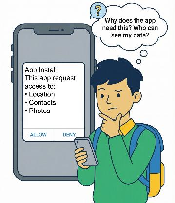

# Chapter 4: Ethics and Responsible AI

## Class 8 - Computational Thinking and Artificial Intelligence
### CBSE Student Handbook

---

---

## What is this Chapter About?

In earlier chapters, you learned how Artificial Intelligence (AI) systems collect data, recognize patterns, and make predictions. AI helps us in education, healthcare, business, and daily life. But as AI becomes more powerful, we must ask:

> **How should AI be created and used responsibly?**

**Responsible AI** means designing and using artificial intelligence in ways that are **fair, safe, transparent, and beneficial to society**.

Technology does not exist alone — it affects people, communities, and society. The choices AI systems make can influence opportunities, decisions, and even people's lives. That's why technology must be guided by **ethical principles**.

---

## Key Questions We Will Explore

1. What do we mean by **AI ethics**?
2. Why is **privacy** important in the digital world?
3. How can **bias** affect AI decisions?
4. What is **misinformation**, and why does it spread so easily?
5. Who is **responsible** when AI systems make mistakes?

---

## 4.1 What is AI Ethics?

When new technology is created, people often ask:

> **"What can this technology do?"**

But there is another question that is equally important:

> **"What should this technology do?"**

This second question takes us into the world of **ethics**.

### Definition

**AI Ethics** refers to the values and principles that guide how artificial intelligence systems should be designed, developed, and used.

### Why Ethics Matters

Ethics remind us that technology must serve people and society. AI ethics ensure that systems:

- ✅ **Are fair** — Treat everyone equally
- ✅ **Respect privacy** — Protect personal information
- ✅ **Help society** — Benefit people, not harm them
- ✅ **Remain accountable** — Someone is responsible for their actions

### Simple Example

Imagine an AI system used in a hospital to help doctors. Ethical AI would:
- Treat all patients equally (rich or poor)
- Keep patient data private
- Help doctors make better decisions
- Allow doctors to overrule the AI if needed

> **Reflect:** Can a system be considered successful if it is fast and accurate but harms certain groups of people?

---

## 4.2 Privacy in the Digital World

### What is Privacy?

**Privacy** means keeping your personal information safe and under your control.

### What Data Do Apps Collect?

Think about the apps and websites you use daily. Many platforms collect:

| Type of Data | Example |
|---|---|
| Your name | Full name, username |
| Your location | GPS coordinates, city |
| Your photographs | Selfies, camera roll |
| Health information | Step count, heart rate |
| Browsing history | Websites you visit |
| Contact details | Phone numbers, email |

### Why is Privacy Important?

If personal information is misused, it can cause serious problems:

- 🔴 **Identity theft** — Someone pretends to be you
- 🔴 **Financial fraud** — Money stolen from your accounts
- 🔴 **Reputation damage** — Embarrassing information shared publicly

### Before Sharing Data Online, Ask:

1. ❓ Why is this information needed?
2. ❓ Who will be able to see it?
3. ❓ How long will it be stored?
4. ❓ Can I delete it later?

### Good Digital Habits

✅ Never share sensitive information like:
- OTPs (One-Time Passwords)
- Bank account details
- Passwords
- PINs (Personal Identification Numbers)

✅ Always think before clicking "Allow" on permission requests

> **Remember:** Privacy is NOT about hiding from the world. It is about having **control** over your personal information.

---

## 4.3 Bias and Fairness in AI

### What is Bias in AI?

Artificial Intelligence systems learn from data. But what happens if the data itself is incomplete or unfair? The system may learn patterns that are also unfair. This is known as **bias**.

### Problems Caused by AI Bias

An unfair AI system may:

- ❌ **Reject deserving candidates** — e.g., qualified people not getting jobs
- ❌ **Spread stereotypes** — e.g., associating certain jobs with specific genders
- ❌ **Ignore minority groups** — e.g., not recognizing faces of certain ethnicities
- ❌ **Make incorrect predictions** — e.g., wrong medical diagnoses

### Real-World Example: Facial Recognition

A facial recognition system trained mostly with images of people from one region may not correctly recognize people from other regions. In one famous case, an AI system couldn't detect a dark-skinned person's face until she wore a white mask!

### Simple Example: Sports Recommendation

Consider a school building an AI program to recommend sports:

| Sport | Boys who enjoyed it | Girls who enjoyed it |
|---|---|---|
| Cricket | 55 | 15 |
| Badminton | 10 | 20 |

**Think:**
- What sport will the AI recommend to a new girl student?
- Is the AI making recommendations based on ability or data patterns?
- Is this fair?

### How Can Bias Be Reduced?

| Strategy | How It Helps |
|---|---|
| 🌍 Use diverse data | Include data from all groups |
| 🔬 Test carefully | Check before releasing |
| 👨‍⚖️ Human review | Let people check AI decisions |
| 📊 Monitor regularly | Keep checking performance |

**Fair AI systems** aim to treat people equally and respectfully. But fairness does not happen automatically — it requires careful design, continuous testing, and responsible use.

---

## 4.4 Misinformation and Social Impact

### What is Misinformation?

**Misinformation** means incorrect or misleading information shared with others.

### How AI Makes It Worse

Modern AI tools can:

| AI Capability | Potential Misuse |
|---|---|
| Create realistic fake images | Spreading false news |
| Generate fake news articles | Influencing public opinion |
| Imitate voices | Phone scams |
| Produce misleading videos (Deepfakes) | Damaging reputations |

### Impact of Misinformation

Misinformation can affect:

- 🗳️ **Public opinion** — People believe false things
- 🗳️ **Elections** — Fake news influences voters
- 💼 **Careers and reputations** — False accusations
- 🤝 **Public trust** — People stop believing anything
- ☮️ **Social harmony** — Creates divisions

### Real Example

A fake message about a health emergency or an exam cancellation can spread quickly on social media and create confusion before the truth is verified.

### Before Believing or Forwarding:

1. ✅ **Check the source** — Who created it?
2. ✅ **Verify facts** — Use trusted websites
3. ✅ **Read beyond headlines** — Don't just read the title
4. ✅ **Think critically** — Does it make sense?

> **Remember:** Every user has a role in ensuring that truthful and responsible information spreads.

---

## 4.5 Accountability and Human Control

### What is Accountability?

**Accountability** means that humans remain responsible for the decisions and actions of AI systems.

### Important Questions to Ask

When AI is used, we must ask:

- 👤 Who created the system?
- 👤 Who checks whether it works correctly?
- 👤 Who fixes mistakes if they occur?
- 👤 Who is responsible if harm happens?

### Real-World Example: AI in Healthcare

An AI system in a hospital analyzes patient data and suggests which patient needs urgent care. But if the system makes a mistake:

> Who should be responsible — the machine or the people who created and used it?

### The Answer

AI should **assist** human decision-making, not **replace** human judgment. Machines can analyze data quickly, but **final responsibility must always remain with people**.

### Key Fields Where Human Supervision is Essential

- 🏥 Healthcare
- 🏫 Education
- 🏦 Banking
- ⚖️ Law
- 🏛️ Public services

---

## Chapter Summary: Points to Remember

| Concept | Key Point |
|---|---|
| 🤖 **AI Ethics** | Values and principles guiding responsible AI design and use |
| 🔒 **Privacy** | Protecting and controlling personal data |
| ⚖️ **Bias & Fairness** | Unfair data leads to unfair AI outcomes |
| 📰 **Misinformation** | False information spreads easily with digital tools |
| 👤 **Accountability** | Humans must remain responsible for AI decisions |

---

## Mathematics Integration: Comparing Quantities with AI

### Real-Life Application: AI and Data Comparison

Just as AI compares data to make decisions, we compare quantities in mathematics. Let's see how ratios and percentages (from NCERT Class 8, Chapter 8) relate to understanding AI fairness.

### Ratio Concepts

A **ratio** compares two quantities. For example, in the sports recommendation example:
- Ratio of boys who like Cricket to Girls who like Cricket = 55 : 15 = 11 : 3
- This shows a **biased dataset** — the AI learned an unfair pattern!

### Percentage Concepts

**Percentage** tells us how many out of 100.

**Example:** If an AI training dataset has 80 images of cats and 20 images of dogs:
- Percentage of cat images = (80 ÷ 100) × 100 = **80%**
- Percentage of dog images = (20 ÷ 100) × 100 = **20%**
- The AI will be better at recognizing cats because of more data!

### Practice Problems

1. An AI training dataset has 120 images of apples and 80 images of oranges.
   - (a) Find the ratio of apple images to orange images.
   - (b) What percentage of images are apples?
   - (c) What percentage of images are oranges?

2. In a school, an AI system recommends books. It was trained on data where 150 boys and 50 girls read science fiction.
   - (a) Find the ratio of boys to girls who read science fiction.
   - (b) What percentage of science fiction readers are boys?

3. A facial recognition system was trained with 1000 photos. 800 photos are of light-skinned people and 200 are of dark-skinned people.
   - (a) Find the percentage of light-skinned training photos.
   - (b) Find the percentage of dark-skinned training photos.
   - (c) Why might this AI system be biased?

4. **Profit and Loss with AI:** A company spent ₹50,000 developing an AI system that saves ₹8,000 per month in electricity costs.
   - (a) How many months to recover the investment?
   - (b) What is the savings as a percentage of the investment after 12 months?

5. **Discount on AI Tools:** An AI software costs ₹15,000 but is offered at a 20% discount.
   - (a) Find the discount amount.
   - (b) Find the selling price.

---

## Activities

### Activity 1: Privacy Check

**Objective:** Understand what data apps collect

**Steps:**
1. Look at 3 apps on your phone or computer
2. Check what permissions they ask for (camera, location, contacts, etc.)
3. For each app, ask: "Why does this app need this permission?"
4. Write your findings in a table:

| App Name | Permissions Asked | Reason Given | Is it Needed? |
|---|---|---|---|
| | | | |
| | | | |
| | | | |

### Activity 2: Bias Detection

**Objective:** Identify bias in data

**Scenario:** You are building an AI system to recommend movies. Your training data has:

| Movie Type | Boys who liked it | Girls who liked it |
|---|---|---|
| Action | 60 | 10 |
| Comedy | 20 | 40 |
| Romance | 5 | 35 |

**Questions:**
1. What movie type will the AI likely recommend to a boy? A girl?
2. Is this recommendation system fair? Why or why not?
3. How could you make the dataset more balanced?

### Activity 3: Create a Fair Dataset

**Objective:** Practice creating balanced data

Collect 20 images of objects from around your home:
- 5 objects of one type (e.g., spoons)
- 5 objects of another type (e.g., pens)
- 5 objects of a third type (e.g., books)
- 5 objects of a fourth type (e.g., cups)

Ask a friend to test if your dataset is balanced. Would an AI trained on this data be fair?

### Activity 4: Misinformation Detective

**Objective:** Learn to spot fake news

**Steps:**
1. Find 2 news headlines (from social media or news sites)
2. For each headline, answer:
   - Who wrote it?
   - Is the source trustworthy?
   - Can you find the same news on a different website?
   - Are there any emotional words trying to influence you?

3. Share your findings with classmates

### Activity 5: AI Ethics Poster

**Objective:** Spread awareness about responsible AI

Create a poster (on paper or using a computer) that shows:
- One key message about AI ethics
- A simple example
- A colorful illustration

Display it in your classroom or share it online.

---

## Exercise Questions

### A. Multiple Choice Questions

1. AI ethics focus on:
   - a) Making machines faster
   - b) Making machines cheaper
   - c) Ensuring responsible use
   - d) Deleting apps

2. Privacy means:
   - a) Sharing everything online
   - b) Protecting personal information
   - c) Hiding from society
   - d) Deleting apps

3. AI bias can occur when:
   - a) AI systems are turned off
   - b) Data used for training is incomplete or unfair
   - c) Computers are slow
   - d) The internet is not working

4. Before sharing information online, what should you do?
   - a) Share it quickly
   - b) Think about why the information is needed
   - c) Forward it to everyone
   - d) Ignore the message

5. AI systems learn patterns from:
   - a) Books
   - b) Data
   - c) Games
   - d) Images

### B. Fill in the Blanks

1. Misinformation means _____________ information.
2. Fair AI systems treat people _____________.
3. Humans must remain _____________ for AI decisions.
4. AI systems learn patterns from _____________.
5. Incorrect or misleading information shared online is called _____________.

### C. Short Answer Questions

1. Why is privacy important in the digital world?
2. Give one example of misinformation.
3. What does accountability mean in AI systems?
4. What are AI ethics?
5. Why is human supervision important when AI systems are used?

### D. Case-Based Questions

1. A student installs an app that asks for permission to access location, contacts, and photos. The student pauses and thinks about why the app needs this information.
   - What important digital habit is the student practising?

2. An AI system used in healthcare suggests that a patient has a high-risk level. Doctors carefully review the AI's recommendation before making a final decision.
   - Why is human review important in this situation?

3. An AI system is trained mostly with data from one city and later used in other places. The system does not work well for people from different regions.
   - What problem in AI does this example show?

4. A message spreads quickly on social media, but the information in it is incorrect.
   - What is this situation called, and what should users do before sharing such messages?

---

## Glossary

| Term | Meaning |
|---|---|
| **AI Ethics** | Values and principles that guide how AI should be designed and used |
| **Privacy** | Keeping personal information safe and under your control |
| **Bias** | Unfair patterns learned by AI from unbalanced data |
| **Fairness** | Treating all people equally and without prejudice |
| **Misinformation** | False or misleading information shared with others |
| **Accountability** | Being responsible for decisions and actions |
| **Responsible AI** | AI that is fair, safe, transparent, and beneficial |
| **Training Data** | The data used to teach an AI system |
| **Deepfake** | AI-generated fake video or audio that looks real |
| **Transparency** | Being open about how AI systems work |

---

## Project Ideas

### Project 1: Design Your Own Fair AI

Create a simple AI model using Teachable Machine (teachablemachine.withgoogle.com) that:
- Recognizes at least 3 different objects
- Uses balanced training data (equal number of examples for each)
- Test if it works fairly for different inputs

### Project 2: AI Ethics Survey

Conduct a survey in your school:
- Ask 20 students: "What do you know about AI ethics?"
- Ask 20 students: "Have you ever shared information online without checking?"
- Create a report with graphs showing your findings

### Project 3: Create Awareness Material

Create a short video, presentation, or pamphlet about:
- One aspect of AI ethics (privacy, bias, misinformation, or accountability)
- Include examples from daily life
- Share it with your family or community

---

## References

- CBSE Class 8 Computational Thinking and Artificial Intelligence Student Handbook (2026)
- NCERT Mathematics Textbook for Class VIII, Chapter 8: Comparing Quantities
- Teachable Machine: teachablemachine.withgoogle.com
- Machine Learning for Kids: machinelearningforkids.co.uk

---

*"Technology is best when it brings people together." — Matt Mullenweg*
